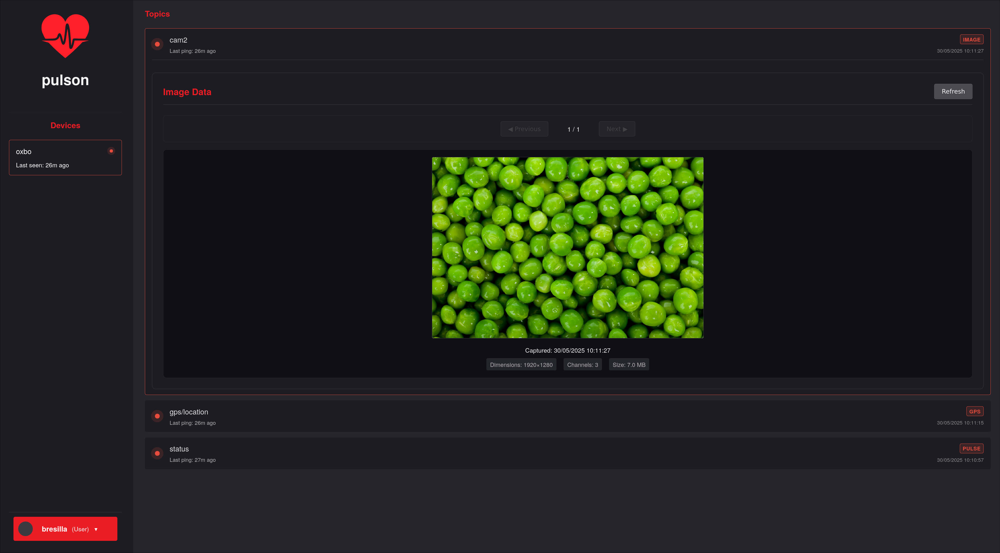

# Pulson

**Real-time system/robot monitoring and tracing with Progressive Web App dashboard**

[](./CHANGELOG.md)
[](./LICENSE.md)

Pulson is a comprehensive monitoring solution for IoT devices, robots, and distributed systems. It provides real-time data collection, visualization, and alerting through both a CLI interface and a modern web dashboard with Progressive Web App (PWA) capabilities.

## 🚀 Features

### Core Capabilities
- **📊 Multi-Type Data Support**: Handle 6 different data types (pulse, GPS, sensor, trigger, event, image)
- **🌐 Real-Time Dashboard**: Modern web interface with live updates every 5 seconds
- **📱 Progressive Web App**: Install as a mobile app with offline support
- **🔐 User Authentication**: JWT-based authentication with role-based access control
- **⚙️ Flexible Configuration**: CLI args, environment variables, and config files
- **🗃️ SQLite Database**: Lightweight, embedded database with user isolation
- **🚀 WASM Performance**: Rust + WebAssembly for optimal performance

### Data Types & Visualizations
- **Pulse**: Simple heartbeat/ping monitoring with timeline visualization
- **GPS**: Location tracking with interactive maps using OpenStreetMap
- **Sensor**: Numeric data with real-time charts and threshold monitoring
- **Trigger**: Boolean state changes with state timeline visualization
- **Event**: Text messages and system events with filterable logs
- **Image**: Visual data with gallery view and metadata support

### Progressive Web App Features
- **📱 Mobile Installation**: Install directly to device home screen
- **🔄 Offline Support**: Basic functionality when disconnected
- **⚡ Service Worker**: Fast loading with intelligent caching
- **🎨 Native Experience**: App-like interface with proper theming

## 📸 Preview

### Desktop Dashboard
<div align="center">
  
  
</div>
<div align="center">
  
  
</div>

### Mobile Experience
<div align="center">
  
  
</div>

### Command Line Interface
<div align="center">
  
</div>

*Real-time monitoring dashboard with responsive design for desktop, mobile, and powerful CLI tools*

## 📖 Quick Start

### Installation

```bash
# Install Rust and dependencies
curl --proto '=https' --tlsv1.2 -sSf https://sh.rustup.rs | sh
rustup default stable

# Install WASM tools
curl https://rustwasm.github.io/wasm-pack/installer/init.sh -sSf | sh
rustup target add wasm32-unknown-unknown

# Build Pulson
cargo build --release
```

### Basic Usage

```bash
# Start the server
pulson --host 127.0.0.1:3030 serve --db-path ~/.local/share/pulson

# Register a user
pulson --host 127.0.0.1:3030 account register --username myuser --password mypass

# Send data
pulson --host 127.0.0.1:3030 pulse --device-id robot1 --topic sensors --data-type sensor --value 23.5

# View dashboard at http://127.0.0.1:3030
```

## 🖥️ Command Line Interface

```bash
pulson --help

realtime system/robot monitoring and tracing

Usage: pulson [OPTIONS] <COMMAND>

Commands:
  serve         Run the HTTP server
  device        Device management (list, delete)
  pulse         Send a pulse with specific data type
  account       User account management (register, login, logout, delete, list)
  config        Configuration management (show, set thresholds)
  help          Print this message or the help of the given subcommand(s)

Options:
  -H, --host <HOST>   Bind address: e.g., 127.0.0.1:3030, 0.0.0.0:8080, https://sub.domain.com, http://localhost:3030
                      Can also be set via PULSON_HOST environment variable [default: 127.0.0.1:3030]
  -h, --help          Print help
```

### Server Management

#### Start Server
```bash
# Basic server startup
pulson --host 127.0.0.1:3030 serve --db-path ~/.local/share/pulson

# With root user capability
pulson --host 127.0.0.1:3030 serve --db-path ~/.local/share/pulson --root-pass SECRET

# With custom thresholds
pulson serve --online-threshold 60 --warning-threshold 600 --stale-threshold 7200

# Enable image storage (disabled by default to save space)
pulson serve --save-images

# Using environment variables
PULSON_HOST=127.0.0.1:3030 pulson serve --db-path ~/.local/share/pulson
```

#### Web Dashboard
Once the server is running, access the dashboard at your configured host address:
- **Local**: http://127.0.0.1:3030
- **Tunnel**: https://your-domain.com

The dashboard provides:
- Real-time device status monitoring
- Interactive data visualizations for all data types
- User authentication and settings management
- Progressive Web App installation options

### Device Management

#### List Devices
```bash
# List all devices
pulson --host 127.0.0.1:3030 device list

# List topics for specific device
pulson --host 127.0.0.1:3030 device list DEVICE_ID

# Watch mode with real-time updates
pulson --host 127.0.0.1:3030 device list --watch --interval 5

# Filter by status
pulson --host 127.0.0.1:3030 device list --status online

# Different output formats
pulson --host 127.0.0.1:3030 device list --format json
pulson --host 127.0.0.1:3030 device list --format compact
```

#### Delete Device
```bash
pulson --host 127.0.0.1:3030 device delete DEVICE_ID
```

### User Account Management

#### Register User
```bash
# Regular user
pulson --host 127.0.0.1:3030 account register --username myuser --password mypass

# Root user (requires server root-pass)
pulson --host 127.0.0.1:3030 account register --username admin --password admin123 --root-pass SECRET
```

#### Authentication
```bash
# Login
pulson --host 127.0.0.1:3030 account login --username myuser --password mypass

# Logout
pulson --host 127.0.0.1:3030 account logout
```

#### User Management (Root Only)
```bash
# List all users
pulson --host 127.0.0.1:3030 account list

# Delete user
pulson --host 127.0.0.1:3030 account delete username
```

## 📊 Data Types & Usage

### 1. Pulse (Heartbeat/Ping)
Simple connectivity monitoring:

```bash
# Simple ping
pulson pulse --device-id robot1 --topic heartbeat --data-type pulse

# Automatic ping (no data specified)
pulson pulse --device-id robot1 --topic heartbeat
```

**Visualization**: Timeline showing device connectivity status

### 2. GPS Location Data
Location tracking with latitude, longitude, and optional altitude:

```bash
# GPS coordinates
pulson pulse --device-id vehicle1 --topic location --data-type gps \
  --latitude 40.7128 --longitude -74.0060 --altitude 10

# With custom JSON
pulson pulse --device-id vehicle1 --topic location --data-type gps \
  '{"latitude": 40.7128, "longitude": -74.0060, "altitude": 10, "accuracy": 5}'
```

**Visualization**: Interactive map with location points and tracking paths

### 3. Sensor Data
Numeric measurements with optional min/max ranges:

```bash
# Temperature sensor
pulson pulse --device-id sensor1 --topic temperature --data-type sensor \
  --value 23.5 --min 0 --max 50

# With custom JSON
pulson pulse --device-id sensor1 --topic temperature --data-type sensor \
  '{"value": 23.5, "unit": "°C", "sensor_id": "temp_01"}'
```

**Visualization**: Real-time charts with threshold monitoring and alerts

### 4. Trigger/State Data
Boolean state changes and digital signals:

```bash
# Door state
pulson pulse --device-id door1 --topic status --data-type trigger --state true

# With custom JSON
pulson pulse --device-id door1 --topic status --data-type trigger \
  '{"state": true, "trigger_type": "motion_detected"}'
```

**Visualization**: State timeline showing true/false transitions

### 5. Event Messages
Text-based events and system messages:

```bash
# System event
pulson pulse --device-id system1 --topic events --data-type event \
  --message "System startup completed"

# With custom JSON
pulson pulse --device-id system1 --topic events --data-type event \
  '{"message": "Error detected", "severity": "high", "code": "E001"}'
```

**Visualization**: Filterable event log with timestamps and severity levels

### 6. Image Data
Visual data with metadata support:

```bash
# From image file
pulson pulse --device-id camera1 --topic photos --data-type image \
  --image-file /path/to/image.jpg --width 640 --height 480

# Raw image data
pulson pulse --device-id camera1 --topic photos --data-type image \
  --image-data "255,128,64,..." --width 320 --height 240 --channels 3

# With custom JSON
pulson pulse --device-id camera1 --topic photos --data-type image \
  '{"image_data": "base64encoded...", "width": 640, "height": 480, "format": "jpeg"}'
```

**Visualization**: Image gallery with metadata display and thumbnails

## 🌐 Flexible Connectivity

The unified `--host` parameter supports multiple deployment scenarios:

```bash
# Local development
export PULSON_HOST=127.0.0.1:3030
pulson device list

# LAN deployment  
export PULSON_HOST=192.168.1.100:3030
pulson device list

# Internet via Cloudflare Tunnel
export PULSON_HOST=https://pulson.your-domain.com
pulson device list

# HTTPS with custom port
export PULSON_HOST=https://monitoring.company.com:8443
pulson device list
```

## ⚙️ Configuration Management

### Status Thresholds

Pulson uses configurable thresholds to determine device and topic status:

- **🟢 Online/Active**: Within online threshold (default: 30s)
- **🟡 Warning/Recent**: Within warning threshold (default: 300s)  
- **🔴 Stale**: Within stale threshold (default: 3600s, topics only)
- **⚫ Offline**: Beyond warning/stale threshold

#### View Current Configuration
```bash
pulson config show
```

#### Set Thresholds
```bash
# Individual thresholds
pulson config set --online-threshold 60
pulson config set --warning-threshold 600
pulson config set --stale-threshold 7200

# Multiple at once
pulson config set --online-threshold 45 --warning-threshold 300 --stale-threshold 3600
```

#### Configuration File
Located at `~/.config/pulson/config.toml`:

```toml
online_threshold_seconds = 30
warning_threshold_seconds = 300
stale_threshold_seconds = 3600
```

#### Environment Variables
```bash
export PULSON_ONLINE_THRESHOLD=60
export PULSON_WARNING_THRESHOLD=600
export PULSON_STALE_THRESHOLD=7200
```

**Priority**: CLI args > Environment variables > Config file > Defaults

#### Dynamic Updates
Configuration changes take effect immediately without server restart!

## 📱 Progressive Web App (PWA)

### Features
- **📱 Mobile Installation**: Add to home screen like a native app
- **🔄 Offline Support**: Cached resources for offline access
- **⚡ Fast Loading**: Service worker optimization
- **🎨 Native Experience**: Full-screen app interface

### Installation
1. Open dashboard in mobile browser (Chrome/Safari)
2. Look for install prompt or "Add to Home Screen"
3. Install - appears on home screen like native app

### Testing PWA
Visit `/pwa-test.html` to test PWA features:
```bash
# Local: http://127.0.0.1:3030/pwa-test.html
# Remote: https://your-domain.com/pwa-test.html
```

## 🚀 Deployment Options

### Local Development
```bash
# Server
pulson --host 127.0.0.1:3030 serve --db-path ~/.local/share/pulson

# Client
export PULSON_HOST=127.0.0.1:3030
pulson device list
```

### LAN Deployment
```bash
# Server (accessible to LAN devices)
pulson --host 0.0.0.0:3030 serve --db-path ~/.local/share/pulson

# Clients
export PULSON_HOST=192.168.1.100:3030
pulson device list
```

### Internet via Cloudflare Tunnel
1. Set up Cloudflare Tunnel pointing to `127.0.0.1:3030`
2. Start server locally:
   ```bash
   pulson --host 127.0.0.1:3030 serve --db-path ~/.local/share/pulson
   ```
3. Configure clients:
   ```bash
   export PULSON_HOST=https://pulson.your-domain.com
   pulson device list
   ```

### Docker Deployment
```bash
# Build container
docker build -t pulson .

# Run server
docker run -d -p 3030:3030 -v pulson-data:/data pulson \
  serve --db-path /data --host 0.0.0.0:3030
```

## 🏗️ Development & Building

### Dependencies

#### Rust Toolchain
```bash
curl --proto '=https' --tlsv1.2 -sSf https://sh.rustup.rs | sh
rustup default stable
```

#### WebAssembly Tools
```bash
curl https://rustwasm.github.io/wasm-pack/installer/init.sh -sSf | sh
rustup target add wasm32-unknown-unknown
```

### Building

#### Full Build
```bash
cargo build --release
```

#### Development Build
```bash
cargo build
```

#### WebAssembly UI Build
```bash
cd pulson-ui
wasm-pack build --target web --out-dir ui
```

### Project Structure
```
pulson/
├── pulson/           # Main server binary
│   ├── src/
│   │   ├── main.rs   # CLI entry point
│   │   ├── cli.rs    # Command definitions
│   │   └── logic/    # Core server logic
├── pulson-ui/        # WebAssembly UI
│   ├── src/          # Rust UI components
│   ├── static/       # Static web assets
│   └── ui/           # Generated WASM files
└── book/             # Documentation
```

## 📚 API Reference

### REST Endpoints

#### Authentication
- `POST /api/register` - Register new user
- `POST /api/login` - User login
- `POST /api/logout` - User logout

#### Device Data
- `GET /api/devices` - List all devices
- `GET /api/devices/:id` - Get device details
- `DELETE /api/devices/:id` - Delete device
- `POST /api/pulse` - Send pulse data

#### Configuration
- `GET /api/config` - Get current configuration
- `PUT /api/config` - Update configuration

### WebSocket Events

Real-time updates via WebSocket at `/ws`:
- `device_update` - Device status changes
- `data_received` - New data points
- `config_update` - Configuration changes

## 🤝 Contributing

1. Fork the repository
2. Create a feature branch
3. Make your changes
4. Add tests if applicable
5. Submit a pull request

See [CONTRIBUTING.md](./CONTRIBUTING.md) for detailed guidelines.

## 📄 License

This project is licensed under the MIT License - see the [LICENSE.md](./LICENSE.md) file for details.

## 🆘 Support

- **Documentation**: See the [book/](./book/) directory
- **Issues**: GitHub Issues for bug reports and feature requests
- **Discussions**: GitHub Discussions for questions and ideas

## 🗓️ Changelog

See [CHANGELOG.md](./CHANGELOG.md) for version history and release notes.

---

**Pulson v0.3.3** - Real-time monitoring made simple, powerful, and mobile-ready.
